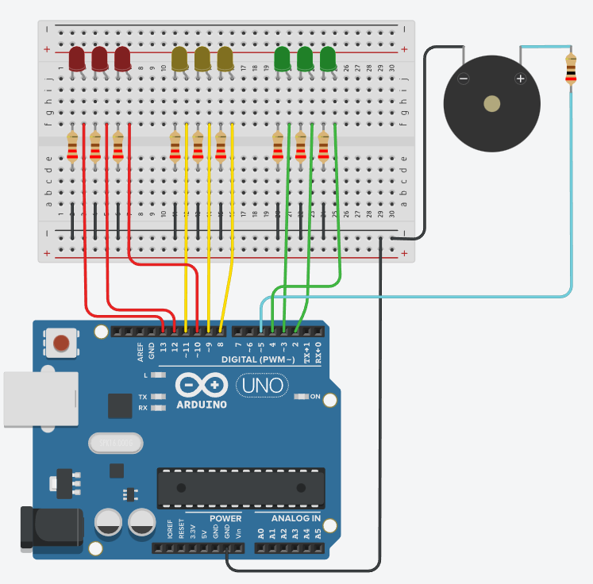

# Dojo numero 1.

## Integrantes.

* Marino German.
* Mariano Lattner.
* Janchuk Marcos.
* Gonzales Lisando.
* Juanas Martin.

## Proyecto : Semaforo con Buzzer

## Descripción

Este código es una implementación de un semáforo para cumplir con las especificaciones dadas por el gobierno de la ciudad. El proyecto utiliza 9 LEDS en total, 3 LEDs de cada color para cada semáforo. También se incluye un zumbador que suena durante los tiempos de espera del semáforo.

## Función  principales.
*   La función "prendeaApagaRojo" enciende los LEDs rojos de los tres semáforos al mismo tiempo y activa el zumbador con un tono fuerte durante 30 segundos.
    
        void  prendeApagaRojo(){
            digitalWrite(LED_ROJO_1,1);
            digitalWrite(LED_ROJO_2,1);
            digitalWrite(LED_ROJO_3,1);
            prendeBuzzerRojo(15, 500, 1000, 2000);
            digitalWrite(LED_ROJO_1,0);
            digitalWrite(LED_ROJO_2,0);
            digitalWrite(LED_ROJO_3,0);
        }

* La función "prendeaApagaAmarillo" enciende los LEDs amarillos y activa el zumbador con un tono suave que suena 1 vez cada 2 segundos durante 5 segundos.

   
        void  prendeApagaAmarillo (){
            digitalWrite(LED_AMARILLO_1,1);
            digitalWrite(LED_AMARILLO_2,1);
            digitalWrite(LED_AMARILLO_3,1);
            prendeBuzzerAmarillo (5,500,500,1000);
            digitalWrite(LED_AMARILLO_1,0);
            digitalWrite(LED_AMARILLO_2,0);
            digitalWrite(LED_AMARILLO_3,0);
        }

* La función "prendeaApagaVerde" enciende los LEDs verdes de los tres semáforos al mismo tiempo durante 45 segundos.

        void  prendeApagaVerde (int timer_Verde){
            digitalWrite(LED_VERDE_1,1);
            digitalWrite(LED_VERDE_2,1);
            digitalWrite(LED_VERDE_3,1);
            delay(timer_Verde);
            digitalWrite(LED_VERDE_1,0);
            digitalWrite(LED_VERDE_2,0);
            digitalWrite(LED_VERDE_3,0);
   	    }
* Esta funcion es la encargada en prender y apagar el buzzer.
De querer que el buzzer suene durante 30 segundos a un ritmo de un tono cada 2 segundos, se debe multiplicar las iteraciones (15) por los milisegundos del tiempo en silencio (2000), esto nos da como resultado los 30000 milisegundos solicitados por la consigna.

        void prendeBuzzerRojo(  int numIteraciones,
                            int tono,
                            int duracionSonido,
                            int tiempoSilencio) {
            for (int i = 0; i < numIteraciones; i++) {
            tone(5, tono, duracionSonido);
            delay(tiempoSilencio);
            }
        }
    
##  🟢🟡🔴 Link al proyecto 🔴🟡🟢
   * [Semaforo con buzzer.](https://www.tinkercad.com/things/b1V3dTmHwtO-dojo-ejercicio-1g/editel?sharecode=poXhex6lr_9aRevdoJRwOCzmFEf2hZjnWLm9vN_egW4 )

## Fuentes 📚.

* [Tutorial Markdown.](https://www.youtube.com/watch?v=oxaH9CFpeEE&t=205s)
* [Lenguaje Markdown.](https://markdown.es/sintaxis-markdown/#linkauto)
* [¿Como crear un repositorio en github ?](https://www.youtube.com/watch?v=eQMcIGVc8N0)
* [¿Cómo usar un Buzzer?](https://www.luisllamas.es/reproducir-sonidos-arduino-buzzer-pasivo-altavoz/)
